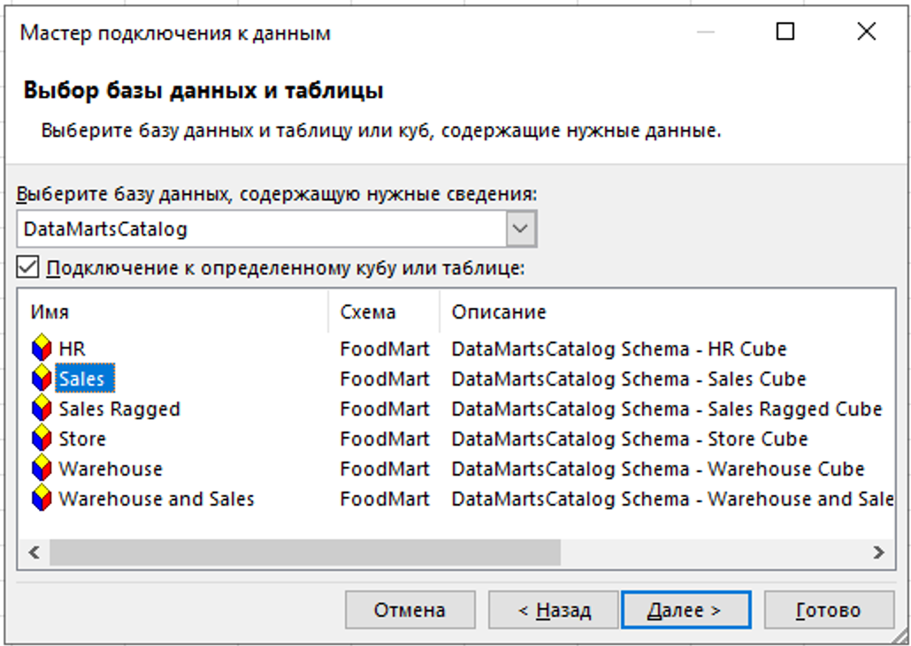
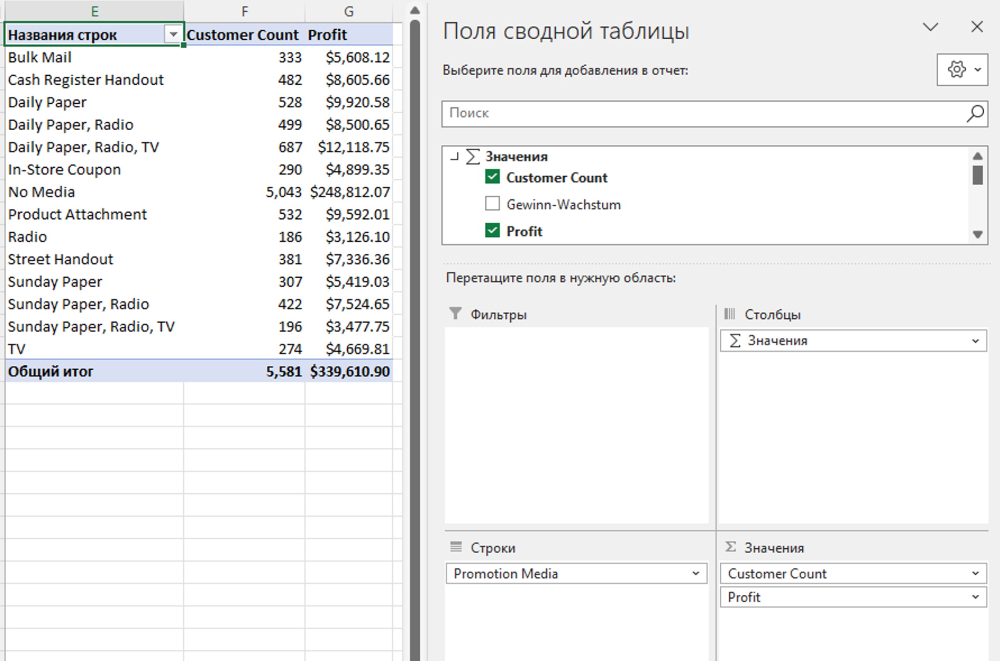
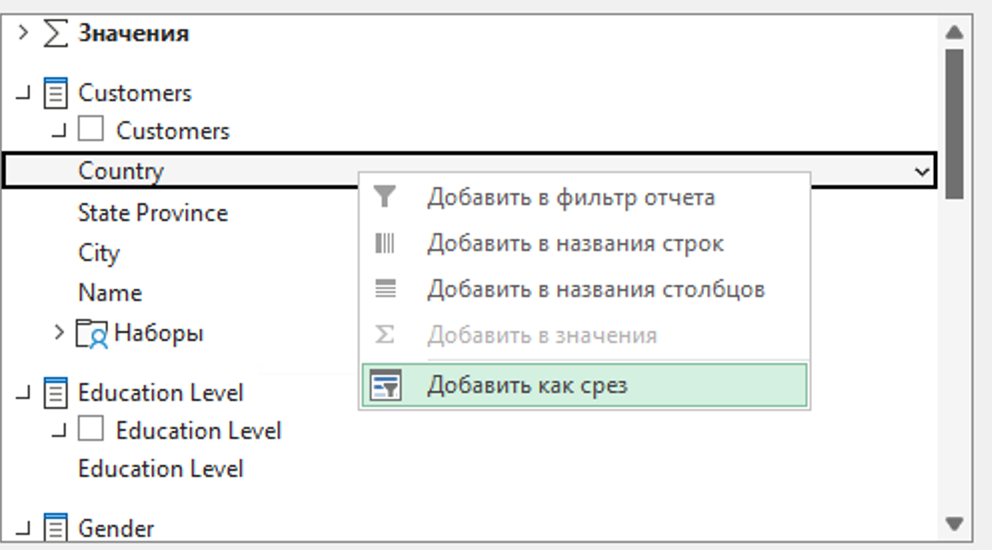
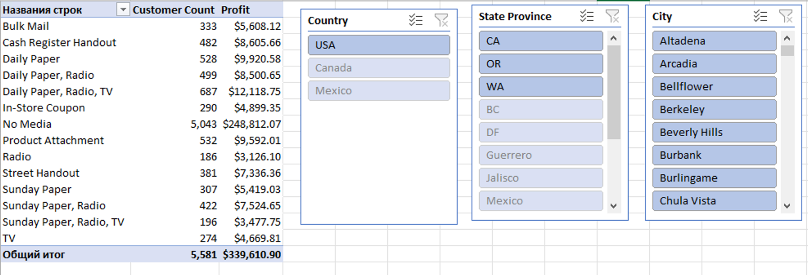
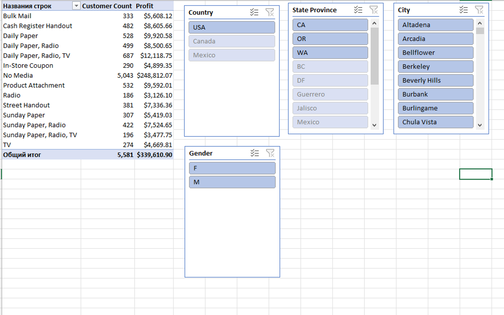
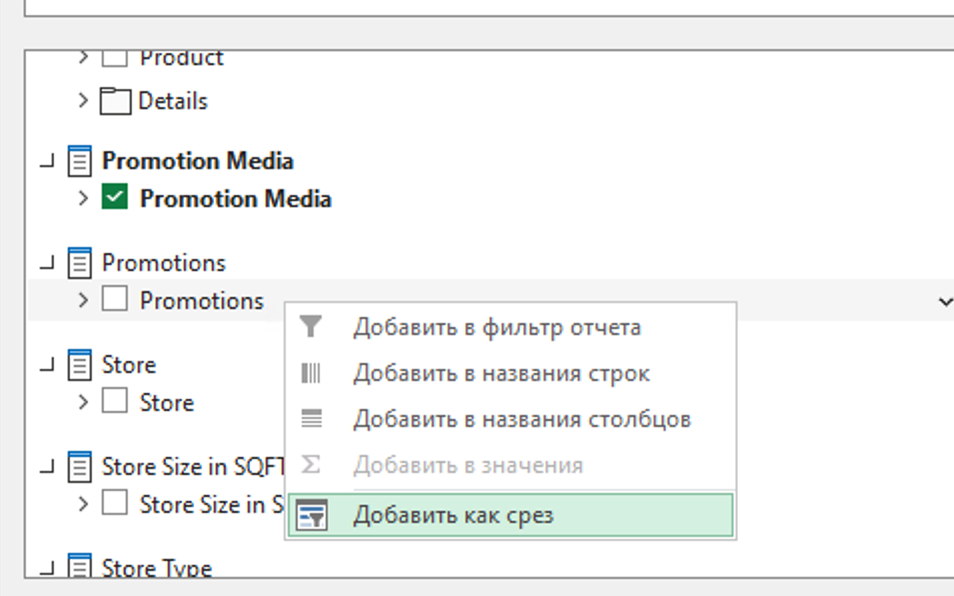
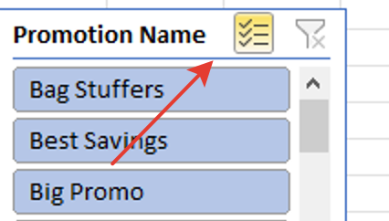
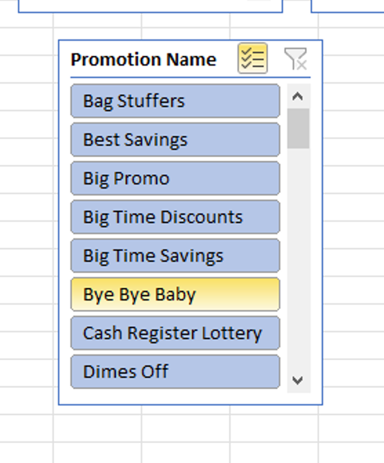
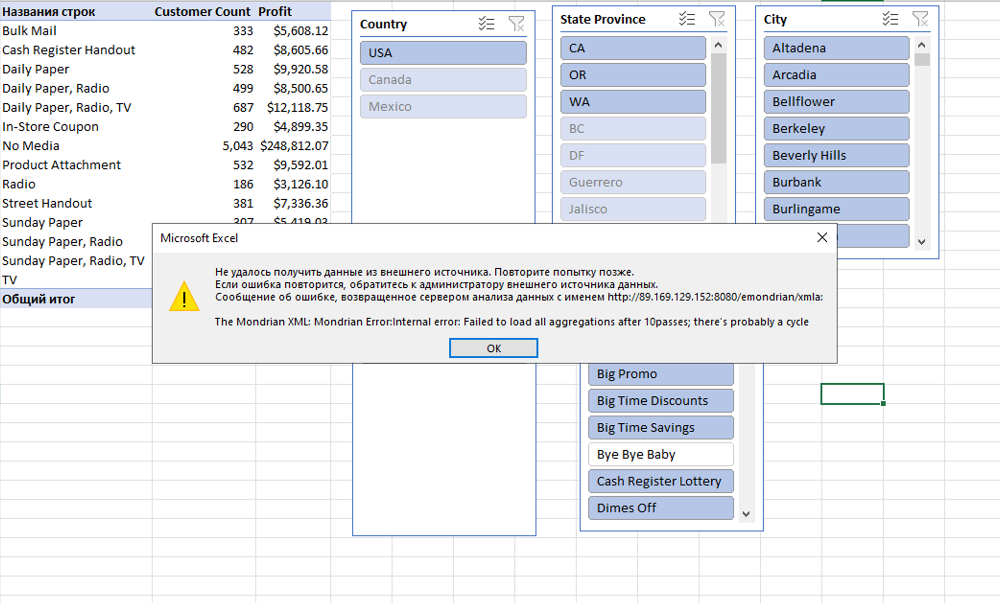

## Повторение ошибки There's probably a cycle

1) Выбираем Sales из Foodmart:

2) Выбираем Promotion Media в строки и меры Customer Count и Profit:

3) Из раздела Customers добавляем срез Country:

4) Аналогично для State province и City:

5) Добавляем слайс на Gender:

6) Добавляем, например, Promotions (у меня с разными получалось):

7) Включаем возможность множественного фильтра:

8) Пытаемся убрать выделение с любого элемента:

9) Получаем ошибку:

